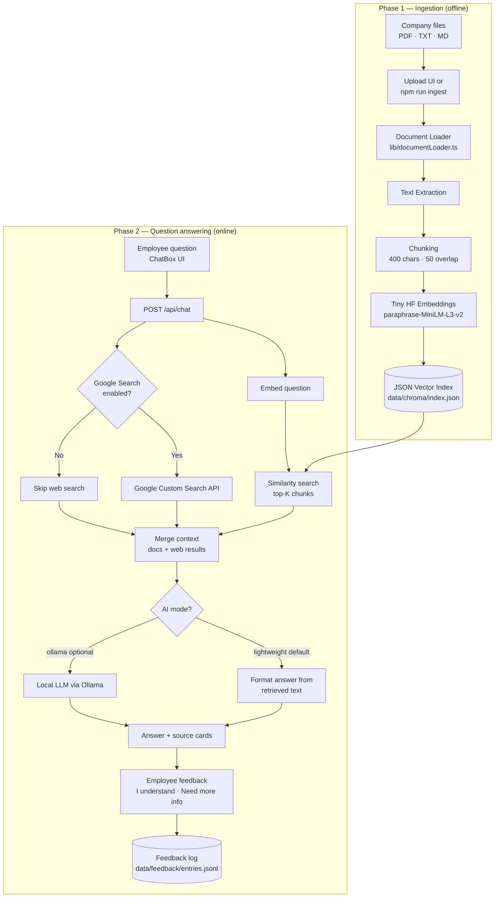
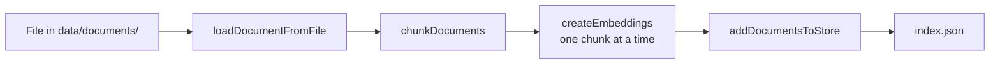
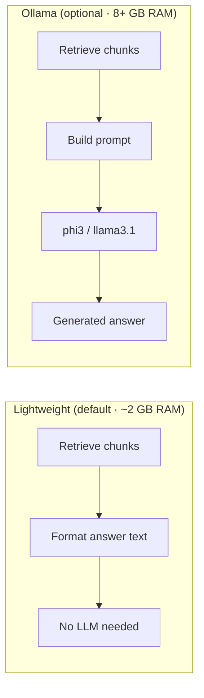

# RAG Pipeline Diagram

Visual overview of the **SkyNixa Company Info Assistant** pipeline (current lightweight setup).

---

## Full System Overview



---

## Ingestion Path (detail)



| Step | What happens | Code |
|------|----------------|------|
| Upload | User drops file or runs CLI ingest | `UploadDocument.tsx`, `scripts/ingestAll.ts` |
| Load | Read PDF / TXT / MD from disk | `lib/documentLoader.ts` |
| Chunk | Split into small passages | `lib/chunkDocuments.ts` |
| Embed | ~17 MB model in Node.js (no Ollama) | `lib/embeddings.ts` |
| Store | Save text + vectors to JSON file | `lib/vectorStore.ts` |

---

## Query Path (detail)

```mermaid
flowchart TD
    Q[User question] --> API[/api/chat]
    API --> VS[similaritySearch]
    VS --> IDX[(index.json)]
    IDX --> VS
    VS --> DOCS[Top-K company chunks]

    API --> GS{ENABLE_GOOGLE_SEARCH?}
    GS -->|true| WEB[Google Search API]
    GS -->|false| SKIP[—]
    WEB --> WEBR[Web snippets + URLs]

    DOCS --> MERGE[Combine sources]
    WEBR --> MERGE
    SKIP --> MERGE

    MERGE --> MODE{AI_PROVIDER}
    MODE -->|lightweight| RET[buildRetrievalAnswer]
    MODE -->|ollama| LLM[ChatOllama generate]

    RET --> UI[Chat UI + SourceCard]
    LLM --> UI
    UI --> FB[/api/feedback]
```

| Step | What happens | Code |
|------|----------------|------|
| Question | Employee types in chat | `components/ChatBox.tsx` |
| Search docs | Cosine similarity on stored vectors | `lib/vectorStore.ts` |
| Search web | Optional Google results | `lib/googleSearch.ts` |
| Answer | Lightweight: stitch retrieved text · Ollama: LLM | `lib/retrievalAnswer.ts`, `lib/ragPipeline.ts` |
| Sources | DOC cards + WEB link cards | `components/SourceCard.tsx` |
| Feedback | Understand / Need more info | `components/AnswerFeedback.tsx`, `app/api/feedback/route.ts` |

---

## Lightweight vs Ollama Mode



---

## End-to-end (one line)

```
Upload → Extract → Chunk → Embed → index.json
                                        ↓
Question → Embed → Search docs (+ optional Google) → Answer → Sources → Feedback
```

---

## Key files

| File | Role |
|------|------|
| `lib/documentLoader.ts` | Read PDF / TXT / MD |
| `lib/chunkDocuments.ts` | Split text into chunks |
| `lib/embeddings.ts` | Hugging Face embedding model |
| `lib/vectorStore.ts` | JSON index + similarity search |
| `lib/googleSearch.ts` | Optional web search |
| `lib/ragPipeline.ts` | Main RAG orchestration |
| `lib/retrievalAnswer.ts` | Lightweight answer formatting |
| `app/api/chat/route.ts` | Chat API endpoint |
| `app/api/ingest/route.ts` | Upload & re-index API |
| `app/api/feedback/route.ts` | Employee feedback API |

See also: [RAG_PIPELINE.md](./RAG_PIPELINE.md) for step-by-step text explanation.
